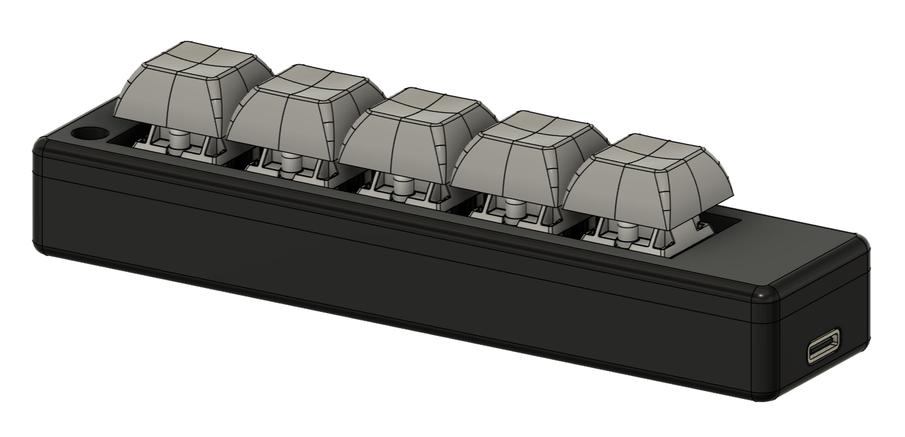
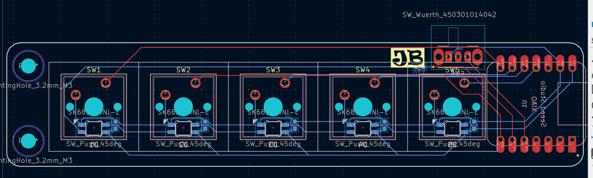
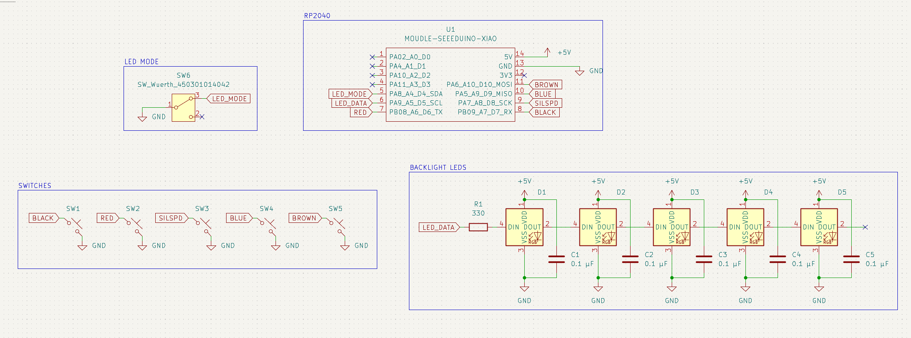
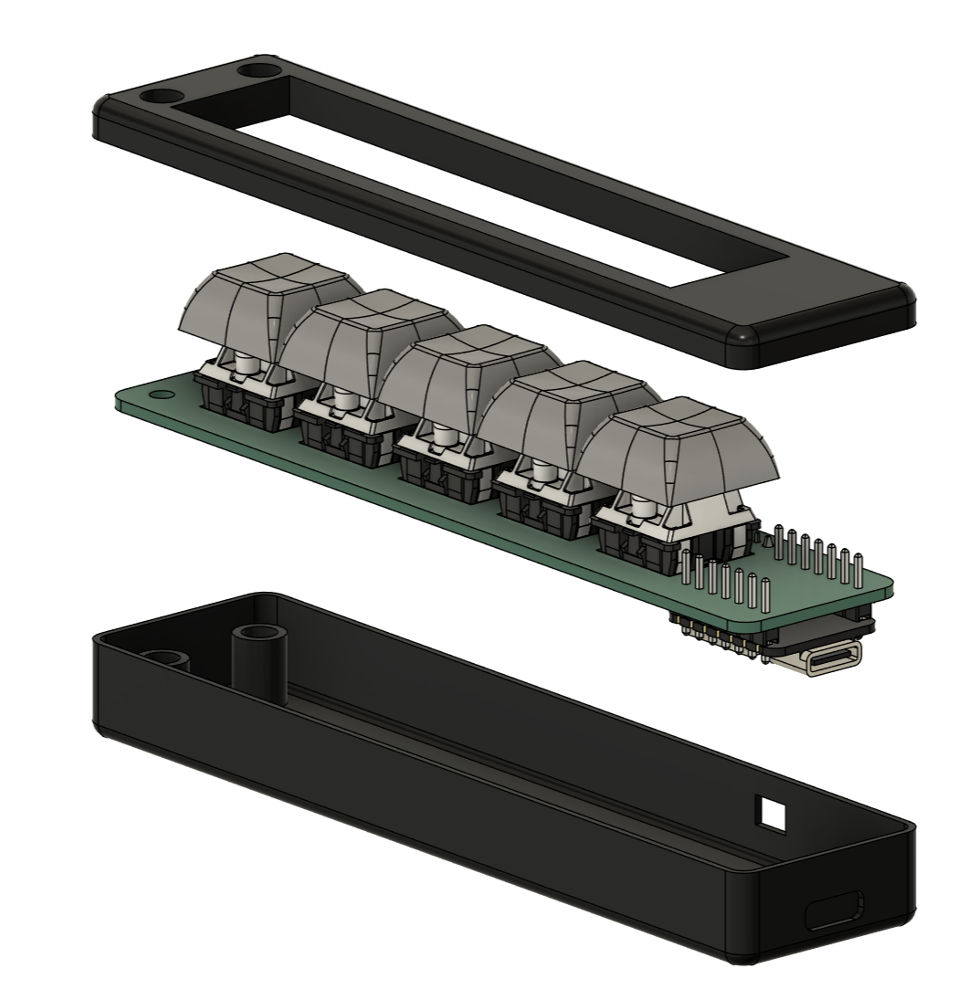
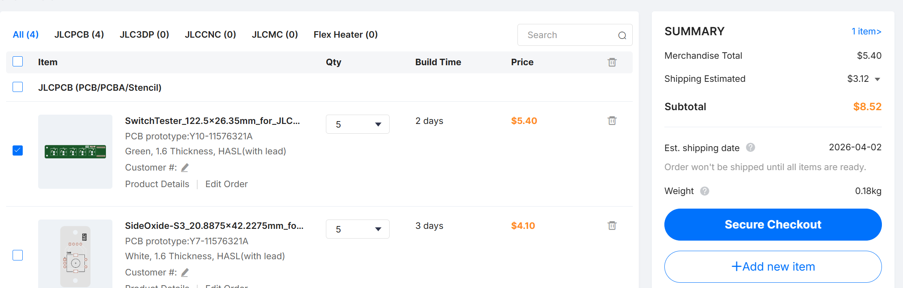
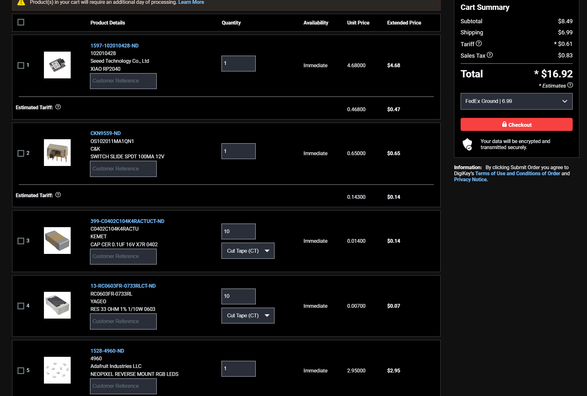
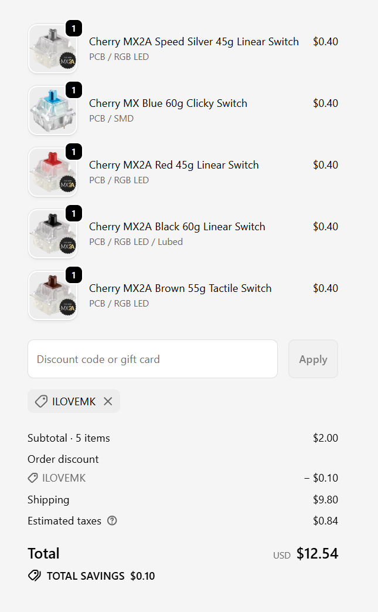

# SwitchTester
 
 SwitchTester is a 5-key switch PCB and housing to test the feel of different Cherry MX switches. Addressable LEDs have two modes: always on (colored), and fade when pressed.

# The PCB

The PCB follows a similar architecture to the Hackpad, and upgrades with decoupling capacitors and a switch to control LED modes. The code is set up to adjust the LED modes depending on the slide switch mode.

# Assembly

The lower and upper case sections are to be 3D printed. The device is assembled using 2x M3x5x5 heatset inserts and 2x M3x10 bolts. The PCB is aligned in the lower case, and the top case encloses it before being bolted down through the standoffs. It should be stable enough, but the USB-C recepticle also nicely rests into the opposite side for added stability. If I find that it is unstable even then, I can add standoffs without holes thoughout the lower case.

# Firmware

The code was created in the Arduino IDE, and uses the FastLED library for the SMD LEDs. The colors are based on guesses, and I will change the code after testing the values.

The first section of the code is simply setup and definitions. It sets the switches as inputs and assigns the pullup resistors, and also initializes the LED index.

The main loop determines the current LED_MODE, checks for keyswitch presses, and outputs to the LED based on the mode and user interaction. FastLED.show() is used to queue the LED instructions and send data through the LED_DATA line.

# BOM

| Part | Quantity | Price Per | Link | 
| :--- | :---: | :---: | :--- |
| **Seeduino Xiao** | 1 | $4.68 | [DigiKey](https://www.digikey.com/short/d3zzwm59) |
| **Slide Switch** | 1 | $0.65 | [DigiKey](https://www.digikey.com/short/p00mmw27) |  
| **0.1uF C 0603** | 5 | $0.08 | [DigiKey](https://www.digikey.com/short/3rn2v9pz) |
| **330ohm R 0603** | 1 | $0.10 | [DigiKey](https://www.digikey.com/short/2qztp77r) |
| **Neopixel LED 10pcs** | 1 | $2.95 | [DigiKey](https://www.digikey.com/short/n79w9mvw) |
| **Cherry MX Blue 60g** | 1 | $0.38 | [MechanicalKeyboards](https://mechanicalkeyboards.com/products/cherry-mx-blue-60g-clicky?variant=48007305003308) |
| **Cherry MX2A Red** | 1 | $0.38 | [MechanicalKeyboards](https://mechanicalkeyboards.com/products/cherry-mx2a-red-45g-linear?variant=48020634239276) |
| **Cherry MX2A Black** | 1 | $0.38 | [MechanicalKeyboards](https://mechanicalkeyboards.com/products/cherry-mx2a-black-60g-linear?variant=48014721253676) |
| **Cherry MX2A Brown** | 1 | $0.38 | [MechanicalKeyboards](https://mechanicalkeyboards.com/products/cherry-mx2a-brown-55g-tactile?variant=48020838383916) |
| **Cherry MX Blue 60g** | 1 | $0.38 | [MechanicalKeyboards](https://mechanicalkeyboards.com/products/cherry-mx-blue-60g-clicky?variant=48007305003308) |
| **DSA Keycaps** | 5 | (have) |  |
| **1x7 Male Headers** | 2 | (have) |  |

Totals
---
| Service  | Price | 
| :--- | :--- |
| **JLCPCB Order** |  $8.52 | 
| **DigiKey Order** |  $16.92 | 
| **MechanicalKeyboards Order** |  $12.54 | 
| **GRAND TOTAL:** |  $37.98 | 

Orders: 
---

